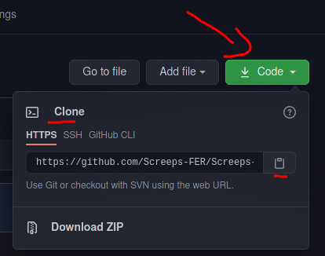
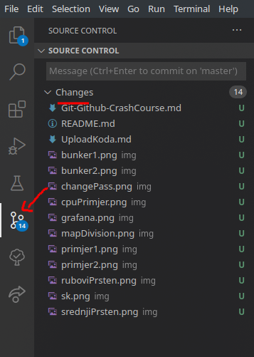

# Github crash course

## Instalirajte git i vscode ako već nemate:
### Archlinux:
```
sudo pacman -S git code
```

### Windows:
Preuzmite i instalirajte sa:
  - https://git-scm.com/download/win
  - https://code.visualstudio.com/Download


## Konfigurirajte GIT:
```
git config --global user.name "Username"
git config --global user.email my.email@email.com
```

## Kloniranje
S stranice repozotorija svog tima potrebno je nabaviti link na git repozotorij.


S komandom:
```
git clone LINK_NA_REPO
```
će se u trenutnom dikretoriju napraviti novi folder s sadržajem repozotorija te će imati git intalizran u sebi.

##  Korištenje
U VSC-u - u source control sekciji moguće je raditi s git repozotorijem.


No mnogo lakše je korsititi komande
```
#prebacivanje na novi branch
git branch "feature/DODATAK_KOJI_DODAJEM"

#doda sve promjene u commit, ako ne želite dodati sve promjene onda umjesto "." potrebno je navesti sve fajlove koje se želi commitat
git add .

#pripremi commit sa porukom
git commit -m "DESKRIPTIVNA PORUKA O PROMJENAMA"

# prenošenje na server
git push
```