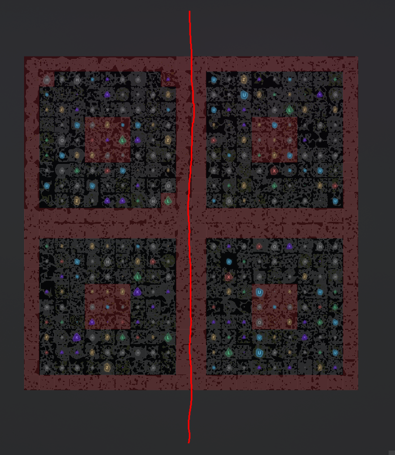
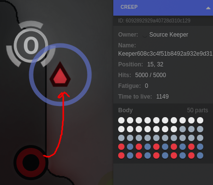
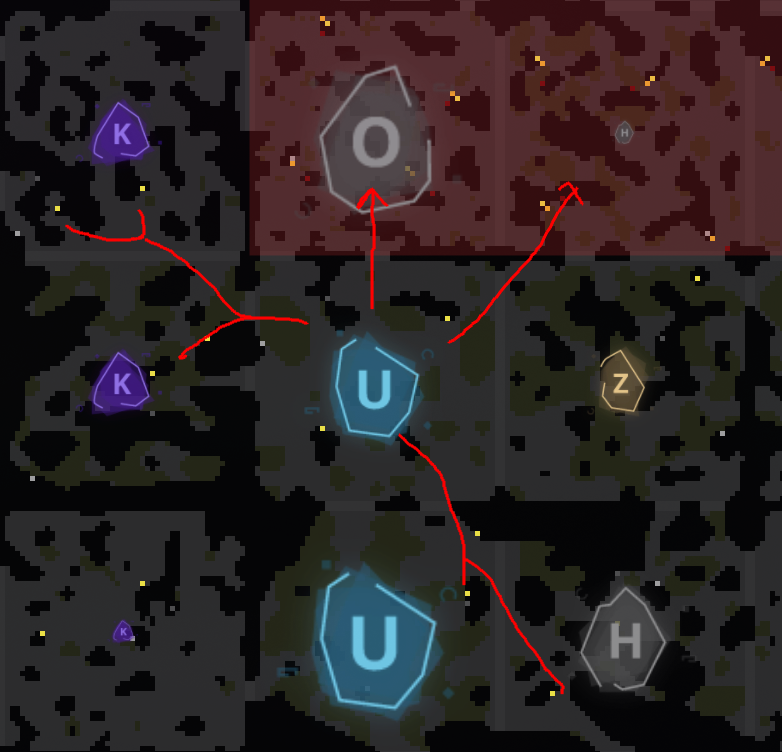
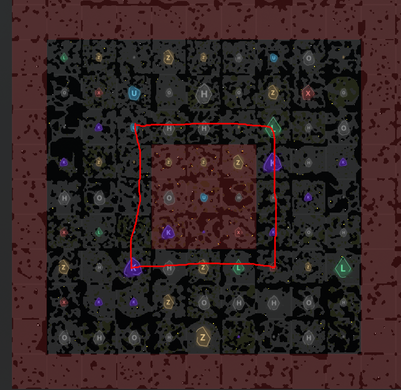
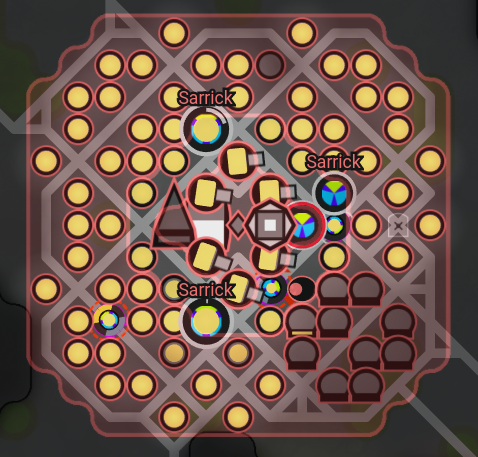
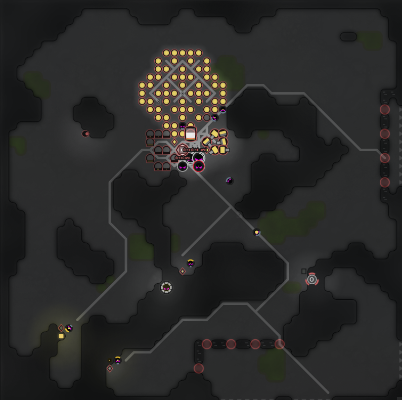
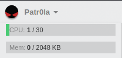

# Screeps-FER

Pozdrav koelge, dobrodošli na introduction/FAQ za screeps natjecanje.

## Sadržaj

- [Screeps-FER](#screeps-fer)
  - [Sadržaj](#sadržaj)
  - [Pridruživanje na server](#pridruživanje-na-server)
  - [Što se točno radi?](#što-se-točno-radi)
  - [Podjela terena](#podjela-terena)
  - [Neki termini](#neki-termini)
  - [Odabir soba](#odabir-soba)
  - [Base building](#base-building)
  - [Resursi skripte](#resursi-skripte)
  - [Potrebi alati - ovisi o timu, ali ovo ćete zasigurno koristiti:](#potrebi-alati---ovisi-o-timu-ali-ovo-ćete-zasigurno-koristiti)
  - [Korisni linkovi](#korisni-linkovi)

## Pridruživanje na server

-   ip: `screeps.ferkaton.com`
-   port: `21025`
-   password: provjeri u `#👾-screeps-general` - opis kanala

## Što se točno radi?

Svaki tim razvija svoj codebase - kojemu je "cilj" da potpuno autonmno igra - sam gradi, sam odlučuje koje sobe će eksplotirat, što će se kolonizirat i sam započinje napadačke akcije. Ukoliko je preteško napraviti da je 100% automatiziran, onda se može koristiti i sustav zastava - tako da svaka zastava označava neki zadatak koji treba raditi u nekoj prostoriji.

## Podjela terena

Timovi su raspodjeljeni prema tablici pinanoj u `#👾-screeps-general`

-   Desno: Tim anoniman/patrola
-   Lijevo: Tim zzt/wumbij
    

## Neki termini

-   RCL = Room Controler Level
    -   određuje koje se strukture mogu graditi u prostoriji
-   GCL = Global Control Level
    -   određuje maksimalni broj soba koje igrač može zauzeti
    -   CPU dostupan igraču, max CPU = 20 + 10 \* GCL
-   Sektor = 9x9 pravokutnik soba koje se mogu zauzeti
-   Autoceste = sobe između Sektora

    -   tu se mogu pronaći endgame resursi
    -   u pravilu je moguće samo proći kroz ove sobe bez brige o barikadama i sličnome

-   SK - Source Keeper - poprilično jak čuvar koji brani resurce u SK sobama
-   
-   SK soba
    -   sobe u centru sektora
    -   ove sobe imaju 3 izvora te jedan mineral na koji je postavljen ekstractor
    -   odličan izvor resurasa

## Odabir soba

Prilikom pridruživanja potrebno je odabrati sobu u kojoj ćete započeti.
S obzirom da je prostor relativno malen - i bolje da je tak jer server radi dosta bolje s manjim terenom, prilikom generiranja odabrane su opcije da je veći broj kvalitetnih soba
Kvalitetne sobe su one sobe koje:

-   imaju 2 izvora te imaju sobe s 2 izvora pored sebe
    
-   Imaju količinu resursa HIGH
-   Nalaze se - u srednjem prsten - ove sobe imaju lakši pristup SK sobama
    
-   uz autoceste - imaju bolji pristup endgame resursima

## Base building

S obzirom da može postati naporno postavljati sve strukture za gradnju ručno, preporuča se jednostavniji sistem postaljanja zastave - i gradnje svega oko te zastave pomoću koda, ili automatsko određivanje dobrih pozicija te postavljanje struktura na te pozicije.
Primjeri neki baza:

## Resursi skripte

-   CPU
    -   Svaka milisekunda pokretanja predstavlja jedan CPU
    -   Svaka akcija koja mijenja stanje igre - npr. (pomicanje, kopanje, attack, etc.) troši 0,2 CPU-a `ukoliko rezultira OK kodom`
    -   Neke radnje također troše i više CPU-a tipa moveTo() -za računanje optimalnog puta. Više info se može pronaći u dokumentaciji.
    -   CPU dostupan igraču, max CPU = 20 + 10 \* GCL
-   Runtime memmor usage - 2MB maksimalna veličina memorije skripte
-   Maksimalna veličina koda - 2MB - gotovo nemoguće za prijeći, osim ukoliko se u kod pred-pakiraju paketi. Loadash je već improtan i nije ga potrebno samostalno upakiravati.
    

## Potrebi alati - ovisi o timu, ali ovo ćete zasigurno koristiti:

-   [vsc](https://code.visualstudio.com/)
-   [node](https://nodejs.org/en/)
-   [git](https://git-scm.com/)

## Korisni linkovi

-   Definitivno pogledati: [Screeps Intro](https://docs.screeps.com/index.html)
-   Korisno za pisanje: [Screeps Api](https://docs.screeps.com/api/)
-   Korisno za postavljanje TypeScript projekta: [TypescriptStarter](https://github.com/screepers/screeps-typescript-starter)
-   Zadnja stvar za raditi - statistika: [Grafana plugin](https://github.com/screepers/screeps-grafana)

Za bio kakva daljnja pitanja `#👾-screeps-general`
