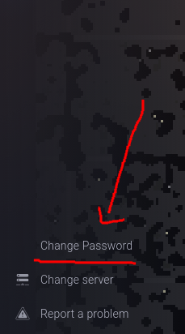

# Upload koda

Nije potrebno pisati sve u IDE u igri, nego je bolje raditi is vsc-a - jer pruža više mogućnosti.

Za upload se koriste različiti alati, npr:
  - rollup
    - https://github.com/Arcath/rollup-plugin-screeps
  - grunt
    - https://github.com/screeps/grunt-screeps

# S obzirom da je podosta teže postaviti SSL na server, cijeli server korsiti http - tako i za upload koda. S obzirom da se zajedno sa kodom prenosi autorizacija - email i šifra, potrebno je koristiti jedinstvenu širu - `niti slučajno istu šifru koju igdje drugdje koristite`

Šifra se postavlja u izborniku > change password

nakon promjenjene šifre i postavljanja grunt ili roolup taska jako je jednostavno prenjeti kod.

Ovo će biti pred-konfigurirano u timski repozotorij.